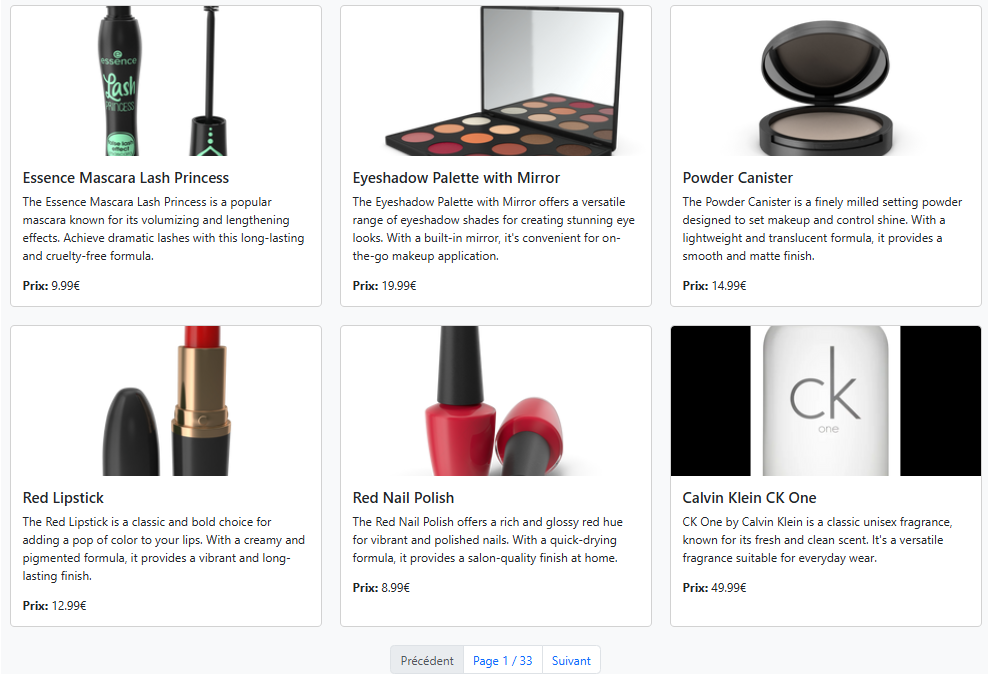

# TP React Hooks - Application de Gestion de Produits

Ce TP a pour objectif de mettre en pratique l'utilisation des Hooks React (useState, useEffect, useContext) ainsi que la création de Hooks personnalisés.

## Installation et configuration initiale

1. Cloner le dépôt :
```bash
git clone https://github.com/pr-daaif/tp-react-hooks.git
cd tp-react-hooks
```

2. Créer votre propre dépôt sur Github et changer le remote :
```bash
# Supprimer le remote origine
git remote remove origin

# Ajouter votre nouveau remote
git remote add origin https://github.com/[votre-username]/tp-react-hooks.git

# Premier push
git push -u origin main
```

3. Installer les dépendances :
```bash
npm install
```

4. Lancer l'application :
```bash
npm start
```

## Instructions pour le TP

Pour chaque exercice :
1. Lisez attentivement l'énoncé
2. Implémentez la solution
3. Testez votre implémentation (pensez à faire des copies d'écran)
4. Mettez à jour la section correspondante dans ce README avec :
   - Une brève explication de votre solution
   - Des captures d'écran montrant le fonctionnement
   - Les difficultés rencontrées et comment vous les avez résolues
5. Commitez vos changements avec un message descriptif

### Exercice 1 : État et Effets 
#### Objectif : Implémenter une recherche en temps réel


### Exercice 2 : Context et Internationalisation
#### Objectif : Gérer les préférences de langue

Je crée d'abord le composant langageSelectore qui va me servir à choisir la langue 


<hr>
Je crée le laguageContext


<hr>
J'enveloppe mon application avec les balises languageContext.Provider pour fournir le choix de la langue surant la navigation de l'application


### Exercice 3 : Hooks Personnalisés
#### Objectif : Créer des hooks réutilisables
La création du hook useDebounce:

<hr>
La création du hook useLocalStorage:


### Exercice 4 : Gestion Asynchrone et Pagination
#### Objectif : Gérer le chargement et la pagination
<ul>
<li>État de la page : Le state page est utilisé pour suivre la page courante.</li>
<li>Limite des résultats : Une limite de 6 produits par page est définie.</li>
<li>Calcul du skip : Le nombre de produits à ignorer est calculé par skip = (page - 1) * limit pour récupérer la bonne tranche de résultats.</li>
<li>Récupération des produits : L'API est appelée avec des paramètres skip et limit pour récupérer les produits de la page courante.</li>
<li>Gestion de la pagination :</li>
<li>nextPage : Incrémente la page si elle n'est pas la dernière.</li>
<li>previousPage : Décrémente la page si elle n'est pas la première.</li>
<li>Total des pages : Le nombre total de pages est calculé à partir du nombre total de produits retournés par l'API.</li>
</ul>

## Rendu

- Ajoutez l'URL de votre dépôt Github dans  **Classroom** et envoyer la réponse dès le démarage de votre projet.
- Les push doivent se faire au fûr et à mesure que vous avancez dans votre projet.
- Le README.md doit être à jour avec vos réponses et captures d'écran. 
- Chaques exercice doit faire l'objet d'au moins un commit avec un message mentionnant le numéro de l'exercice.